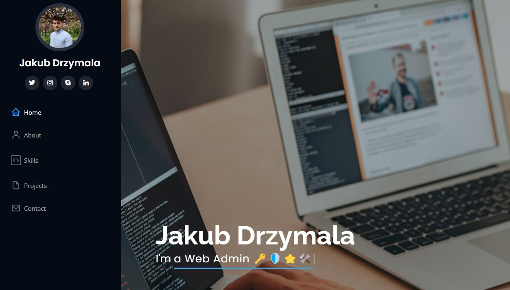

# MY-DEV-SITE-2

This is my second portfolio site. I wanted to present my projects in a story-like way. You can find this deplozed site at :point_right: <https://www.drzymala.dev/> :feelsgood:



I used iPortfolio theme designed by [BootstrapMade](https://bootstrapmade.com/) and modified it a bit. 👷
[iPortfolio-theme](https://bootstrapmade.com/demo/iPortfolio/)

## Features 💡

- Scores 100% on a11y / Performance / PWA / SEO
- PWA (desktop & mobile)
- Easy to customize
- Nice site structure
- Tablet & mobile friendly
- Amazing illustrations by me and :two_hearts:[LouiseAmelie](https://lui-design.com/):two_hearts:
- Shows my :computer:Github:computer: projects with a story for each one
- Minimal but sufficient one/page: :file_folder: projects / :man: about me / :mailbox_with_mail: contact me

## Design ✏️

Project was created using palette of colors from [flatuicolors.com](https://flatuicolors.com/palette/us)

## Structure

```bash
.
├───assets                      # Assets
│   ├───css                     # style.css
│   ├───img                     # illustrations from (undraw.co)
│   │   ├───projects
│   │   └───referrals
│   ├───js                      # Javascript code
│   └───vendor                  # Here things get interesting
│       ├───aos
│       ├───bootstrap
│       │   ├───css
│       │   └───js
│       ├───bootstrap-icons # icons
│       │   └───fonts
│       ├───boxicons
│       │   ├───css
│       │   └───fonts
│       ├───glightbox
│       │   ├───css
│       │   └───js
│       ├───isotope-layout
│       ├───php-email-form
│       ├───purecounter
│       ├───swiper
│       ├───typed.js
│       └───waypoints
└───forms                       # Form related code
```

## Prerequisites

None really, apart from web browser. Just go to the website, duh ... :octocat:

## Built with

- Adobe XD
- Figma
- React & GraphQL
- Google recaptcha
- VSCode
- And these useful JavaScript libraries

## License

The theme this project was build upon is licensed under the MIT License - see the [LICENSE](LICENSE) file for more details.

## Support

If you love this website template and want to support me, you can do so through my GitHub profile. :feelsgood:

## Links

- [The page](https://www.drzymala.com/),
- [Theme site](https://bootstrapmade.com/demo/iPortfolio/),
